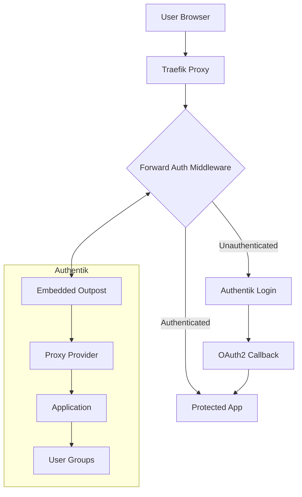

# Authentik + Traefik Forward Authentication Complete Setup Guide

## Overview

This guide provides a comprehensive walkthrough for setting up Authentik forward authentication with Traefik to protect applications like Dashy. The solution uses blueprints for automated configuration and ensures proper permissions for embedded outposts.

### Architecture



### Key Components

1. **Authentik Server**: Identity provider and authentication server
2. **Embedded Outpost**: Built-in outpost for forward authentication
3. **Proxy Provider**: Configured for `forward_domain` mode
4. **Traefik Middleware**: Forward auth middleware pointing to outpost
5. **Application Protection**: Group-based access control
6. **Automated Setup**: Blueprint-driven configuration

## File Structure

```
config/
├── authentik/
│   ├── blueprints/
│   │   ├── 00-flows.yaml           # Authentication flows
│   │   ├── 01-users.yaml           # Users and groups
│   │   ├── 02-provider.yaml        # Proxy provider & application
│   │   ├── 03-simple-policy.yaml   # Access policies
│   │   ├── 04-outpost-provider-assignment.yaml  # Outpost config
│   │   └── 05-outpost-permissions.yaml          # Group permissions
│   └── startup-scripts/
│       └── apply-blueprints.sh     # Automated blueprint application
└── traefik/
    └── dynamic/
        └── middleware.yml          # Forward auth middleware
```

## Blueprint Configuration

### 1. Authentication Flows (00-flows.yaml)

```yaml
# yaml-language-server: $schema=https://goauthentik.io/blueprints/schema.json
version: 1
metadata:
  name: dashy-00-flows
  labels:
    blueprints.goauthentik.io/instantiate: "true"
    blueprints.goauthentik.io/description: "Step 0: Authentication flows"
context: {}
entries:
  # Create explicit consent flow for provider authorization
  - model: authentik_flows.flow
    state: present
    identifiers:
      slug: default-provider-authorization-explicit-consent
    attrs:
      name: "Authorize Application"
      slug: default-provider-authorization-explicit-consent
      title: "Redirecting to %(app)s"
      designation: authorization
      authentication: require_authenticated
      
  # Create invalidation flow
  - model: authentik_flows.flow
    state: present
    identifiers:
      slug: default-invalidation-flow
    attrs:
      name: "Logout"
      slug: default-invalidation-flow
      title: "Log out"
      designation: invalidation
```

### 2. Users and Groups (01-users.yaml)

```yaml
# yaml-language-server: $schema=https://goauthentik.io/blueprints/schema.json
version: 1
metadata:
  name: dashy-01-users
  labels:
    blueprints.goauthentik.io/instantiate: "true"
    blueprints.goauthentik.io/description: "Step 1: Create users and groups"
context: {}
entries:
  # Create test user
  - model: authentik_core.user
    state: present
    identifiers:
      username: testuser
    attrs:
      username: testuser
      name: Test User
      email: test@zoi.local
      is_active: true
      password: !Env [AUTHENTIK_TEST_PASSWORD, TestPassword123!]

  # Create access group for Dashy users
  - model: authentik_core.group
    state: present
    identifiers:
      name: dashy-users
    attrs:
      name: dashy-users
      is_superuser: false
      users:
        - !Find [authentik_core.user, [username, testuser]]
```

### 3. Proxy Provider and Application (02-provider.yaml)

```yaml
# yaml-language-server: $schema=https://goauthentik.io/blueprints/schema.json
version: 1
metadata:
  name: dashy-02-provider
  labels:
    blueprints.goauthentik.io/instantiate: "true"
    blueprints.goauthentik.io/description: "Step 2: Create proxy provider and application"
context: {}
entries:
  # Create Proxy Provider with forward_domain mode
  - model: authentik_providers_proxy.proxyprovider
    state: present
    identifiers:
      name: Dashy Forward Auth
    attrs:
      name: "Dashy Forward Auth"
      mode: forward_domain
      external_host: http://dashy.zoi.local
      internal_host: http://dashy:8080
      cookie_domain: zoi.local
      authorization_flow: !Find [authentik_flows.flow, [slug, "default-provider-authorization-explicit-consent"]]
      invalidation_flow: !Find [authentik_flows.flow, [slug, "default-invalidation-flow"]]

  # Create Application with group assignment
  - model: authentik_core.application
    state: present
    identifiers:
      slug: dashy-forward-auth-app
    attrs:
      name: Dashy Forward Auth App
      slug: dashy-forward-auth-app
      group: dashy-users
      provider: !Find [authentik_providers_proxy.proxyprovider, [name, Dashy Forward Auth]]
      launch_url: !Env [DASHY_HOST, http://dashy.zoi.local]
```

### 4. Access Policies (03-simple-policy.yaml)

```yaml
# yaml-language-server: $schema=https://goauthentik.io/blueprints/schema.json
version: 1
metadata:
  name: dashy-03-simple-policy
  labels:
    blueprints.goauthentik.io/instantiate: "true"
    blueprints.goauthentik.io/description: "Step 3: Simple group-based access policy"
context: {}
entries:
  # Create group membership policy
  - model: authentik_policies_expression.expressionpolicy
    state: present
    identifiers:
      name: dashy-access-policy
    attrs:
      name: dashy-access-policy
      expression: 'return "dashy-users" in [group.name for group in request.user.ak_groups.all()]'
      execution_logging: false

  # Bind policy to Dashy application
  - model: authentik_policies.policybinding
    state: present
    identifiers:
      policy: !Find [authentik_policies_expression.expressionpolicy, [name, dashy-access-policy]]
      target: !Find [authentik_core.application, [slug, dashy-forward-auth-app]]
    attrs:
      policy: !Find [authentik_policies_expression.expressionpolicy, [name, dashy-access-policy]]
      target: !Find [authentik_core.application, [slug, dashy-forward-auth-app]]
      enabled: true
      order: 0
```

### 5. Outpost Configuration (04-outpost-provider-assignment.yaml)

```yaml
# yaml-language-server: $schema=https://goauthentik.io/blueprints/schema.json
version: 1
metadata:
  name: dashy-04-outpost-provider-assignment
  labels:
    blueprints.goauthentik.io/instantiate: "true"
    blueprints.goauthentik.io/description: "Step 4: Assign provider to embedded outpost"
context: {}
entries:
  # Configure embedded outpost with external domain
  - model: authentik_outposts.outpost
    state: present
    identifiers:
      name: "authentik Embedded Outpost"
    attrs:
      name: "authentik Embedded Outpost"
      type: proxy
      providers:
        - !Find [authentik_providers_proxy.proxyprovider, [name, "Dashy Forward Auth"]]
      config:
        authentik_host: http://auth.zoi.local
        authentik_host_insecure: true
```

### 6. Outpost Permissions (05-outpost-permissions.yaml)

```yaml
# yaml-language-server: $schema=https://goauthentik.io/blueprints/schema.json
version: 1
metadata:
  name: dashy-05-outpost-permissions
  labels:
    blueprints.goauthentik.io/instantiate: "true"
    blueprints.goauthentik.io/description: "Step 5: Ensure outpost permissions are configured"
context: {}
entries:
  # Ensure the authentik Admins group exists with superuser permissions
  - model: authentik_core.group
    state: present
    identifiers:
      name: "authentik Admins"
    attrs:
      name: "authentik Admins"
      is_superuser: true

  # Note: Outpost service account users are automatically created when outposts start
  # They need to be added to authentik Admins group via post-deployment script
```

## Traefik Configuration

### Forward Auth Middleware (config/traefik/dynamic/middleware.yml)

```yaml
http:
  middlewares:
    authentik:
      forwardAuth:
        address: "http://auth.zoi.local/outpost.goauthentik.io/auth/traefik"
        trustForwardHeader: true
        authResponseHeaders:
          - X-authentik-username
          - X-authentik-groups
          - X-authentik-email
          - X-authentik-name
          - X-authentik-uid
        authRequestHeaders:
          - Accept
          - Accept-Encoding
          - Accept-Language
          - Authorization
          - Cache-Control
          - Content-Type
          - Cookie
          - Host
          - Referer
          - User-Agent
          - X-Forwarded-For
          - X-Forwarded-Host
          - X-Forwarded-Proto
          - X-Forwarded-Uri
          - X-Original-URL
          - X-Real-IP
          - X-Requested-With
```

## Docker Compose Configuration

### Authentik Services

```yaml
services:
  authentik-server:
    image: ghcr.io/goauthentik/server:2025.2.4
    restart: unless-stopped
    command: server
    environment:
      - AUTHENTIK_REDIS__HOST=redis
      - AUTHENTIK_POSTGRESQL__HOST=postgres
      - AUTHENTIK_POSTGRESQL__USER=authentik
      - AUTHENTIK_POSTGRESQL__NAME=authentik
      - AUTHENTIK_POSTGRESQL__PASSWORD=authentik_password
      - AUTHENTIK_HOST=http://auth.zoi.local
      - AUTHENTIK_HOST_BROWSER=http://auth.zoi.local
      - AUTHENTIK_SECRET_KEY=your-secret-key
    volumes:
      - authentik_media:/media
      - authentik_templates:/templates
      - ./config/authentik/blueprints:/blueprints/custom:ro
      - ./config/authentik/startup-scripts:/blueprints/startup-scripts:ro
    labels:
      # Main Authentik domain
      - "traefik.enable=true"
      - "traefik.http.routers.authentik.rule=Host(`auth.zoi.local`)"
      - "traefik.http.routers.authentik.service=authentik"
      - "traefik.http.services.authentik.loadbalancer.server.port=9000"
      
      # Outpost callback routes for Authentik domain
      - "traefik.http.routers.authentik-outpost.rule=Host(`auth.zoi.local`) && PathPrefix(`/outpost.goauthentik.io/`)"
      - "traefik.http.routers.authentik-outpost.service=authentik"
      - "traefik.http.routers.authentik-outpost.priority=100"
      
      # Outpost callback routes for protected app domains (critical for OAuth)
      - "traefik.http.routers.dashy-outpost.rule=Host(`dashy.zoi.local`) && PathPrefix(`/outpost.goauthentik.io/`)"
      - "traefik.http.routers.dashy-outpost.service=authentik"
      - "traefik.http.routers.dashy-outpost.priority=100"
    networks:
      - auth_network
      - database_network
    depends_on:
      postgres:
        condition: service_healthy
      redis:
        condition: service_healthy

  # Post-deployment service to fix outpost permissions
  authentik-post-deploy:
    image: postgres:16-alpine
    restart: "no"
    command: >
      sh -c "
        echo 'Waiting for Authentik blueprints to be applied...';
        sleep 60;
        echo 'Running post-deployment outpost permissions fix...';
        export PGPASSWORD=$$POSTGRES_PASSWORD;
        psql -h postgres -U $$POSTGRES_USER -d $$POSTGRES_DB -c \"
          INSERT INTO authentik_core_user_ak_groups (user_id, group_id) 
          SELECT u.id, g.group_uuid 
          FROM authentik_core_user u, authentik_core_group g 
          WHERE u.username LIKE 'ak-outpost-%' 
          AND g.name = 'authentik Admins' 
          ON CONFLICT DO NOTHING;
        \";
        echo '✅ Post-deployment outpost permissions setup complete!';
      "
    environment:
      - POSTGRES_DB=authentik
      - POSTGRES_USER=authentik
      - POSTGRES_PASSWORD=authentik_password
    depends_on:
      authentik-server:
        condition: service_healthy
      postgres:
        condition: service_healthy
    networks:
      - database_network
```

### Protected Application (Dashy)

```yaml
  dashy:
    image: lissy93/dashy:latest
    restart: unless-stopped
    environment:
      - UID=1000
      - GID=1000
    volumes:
      - dashy_data:/app/user-data
    labels:
      - "traefik.enable=true"
      - "traefik.http.routers.dashy.rule=Host(`dashy.zoi.local`)"
      - "traefik.http.routers.dashy.middlewares=authentik"
      - "traefik.http.routers.dashy.service=dashy"
      - "traefik.http.services.dashy.loadbalancer.server.port=8080"
    networks:
      - frontend_network
    healthcheck:
      test: ["CMD", "curl", "-f", "http://localhost:8080"]
      interval: 30s
      timeout: 10s
      retries: 3
```

## Automated Setup Script

### Blueprint Application Script (config/authentik/startup-scripts/apply-blueprints.sh)

```bash
#!/bin/bash

echo "Starting Authentik blueprint auto-application..."

# Wait for Authentik to be ready
echo "Waiting for Authentik to be ready..."
while ! ak healthcheck > /dev/null 2>&1; do
    echo "Authentik not ready yet, waiting 5 seconds..."
    sleep 5
done

# Wait for default flows to be created
echo "Waiting for Authentik to fully initialize (including default flows)..."
sleep 30

echo "Authentik is fully ready! Starting blueprint application..."

# Debug: Check what files exist
BLUEPRINT_DIR="/blueprints/custom"
echo "DEBUG: Contents of $BLUEPRINT_DIR:"
ls -la "$BLUEPRINT_DIR"

apply_blueprint() {
    local file=$1
    local description=$2
    local full_path="$BLUEPRINT_DIR/$file"
    
    echo "Applying $description: $file"
    
    if [ -f "$full_path" ]; then
        echo "✅ File found, applying..."
        ak apply_blueprint "$full_path"
        if [ $? -eq 0 ]; then
            echo "✅ Successfully applied: $file"
            sleep 5  # Wait between applications
        else
            echo "❌ Failed to apply: $file"
            return 1
        fi
    else
        echo "⚠️  Blueprint file not found: $full_path"
        return 1
    fi
}

# Apply blueprints in correct dependency order
apply_blueprint "00-flows.yaml" "Authentication Flows"
apply_blueprint "01-users.yaml" "Users and Groups"
apply_blueprint "02-provider.yaml" "Proxy Provider and Application"  
apply_blueprint "03-simple-policy.yaml" "Access Policies"
apply_blueprint "04-outpost-provider-assignment.yaml" "Outpost Configuration"
apply_blueprint "05-outpost-permissions.yaml" "Outpost Permissions"

echo "Blueprint auto-application completed successfully! 🎉"
```

## Critical Configuration Details

### 1. Forward Domain Mode

```yaml
mode: forward_domain
external_host: http://dashy.zoi.local
internal_host: http://dashy:8080
cookie_domain: zoi.local
```

**Why this matters:**
- `forward_domain` mode allows protecting multiple subdomains with one provider
- `external_host` must match the domain users access
- `cookie_domain` should be the parent domain for SSO across subdomains

### 2. Outpost Callback Routes

```yaml
# Critical: Outpost callbacks on protected domain
- "traefik.http.routers.dashy-outpost.rule=Host(`dashy.zoi.local`) && PathPrefix(`/outpost.goauthentik.io/`)"
- "traefik.http.routers.dashy-outpost.service=authentik"
- "traefik.http.routers.dashy-outpost.priority=100"
```

**Why this matters:**
- OAuth2 callbacks must be routed to Authentik, not the protected app
- High priority (100) ensures callbacks are caught before app routes
- No forward auth middleware on callback routes prevents infinite loops

### 3. External Domain Configuration

```yaml
config:
  authentik_host: http://auth.zoi.local
  authentik_host_insecure: true
```

**Why this matters:**
- Embedded outpost needs external domain for browser redirects
- `authentik_host_insecure: true` allows HTTP for local development
- Must match the domain configured in Traefik labels

### 4. Outpost Permissions

```sql
INSERT INTO authentik_core_user_ak_groups (user_id, group_id) 
SELECT u.id, g.group_uuid 
FROM authentik_core_user u, authentik_core_group g 
WHERE u.username LIKE 'ak-outpost-%' 
AND g.name = 'authentik Admins' 
ON CONFLICT DO NOTHING;
```

**Why this matters:**
- Outpost service accounts need admin permissions to fetch configuration
- Without this, outposts return 403 Forbidden errors
- Must be applied after outpost creation (hence post-deployment)

## Setup Process

### 1. Initial Setup

```bash
# Start the stack
docker-compose up -d

# Wait for services to be healthy
docker-compose ps

# Verify blueprint application
docker-compose logs authentik-server | grep "Successfully applied"

# Check post-deployment setup
docker-compose logs authentik-post-deploy
```

### 2. Verification Steps

```bash
# 1. Check Authentik admin access
curl -I http://auth.zoi.local

# 2. Test forward auth endpoint
curl -v "http://auth.zoi.local/outpost.goauthentik.io/auth/traefik" \
  -H "X-Forwarded-Proto: http" \
  -H "X-Forwarded-Host: dashy.zoi.local" \
  -H "X-Forwarded-Uri: /"

# 3. Test protected application
curl -I http://dashy.zoi.local

# 4. Verify database configuration
docker-compose exec postgres psql -U authentik -d authentik -c "
SELECT 
  'Applications' as type, COUNT(*) as count 
FROM authentik_core_application 
WHERE name = 'Dashy Forward Auth App'
UNION ALL
SELECT 'Providers', COUNT(*) 
FROM authentik_providers_proxy_proxyprovider 
WHERE external_host LIKE '%dashy%'
UNION ALL
SELECT 'Outpost Users', COUNT(*) 
FROM authentik_core_user u 
JOIN authentik_core_user_ak_groups ug ON u.id = ug.user_id 
JOIN authentik_core_group g ON ug.group_id = g.group_uuid 
WHERE u.username LIKE 'ak-outpost-%' 
AND g.name = 'authentik Admins';
"
```

### 3. Manual Verification via Admin UI

1. **Access Authentik Admin**: http://auth.zoi.local/if/admin/
2. **Login**: admin@zoi.local / admin123!
3. **Check Applications**: Applications → "Dashy Forward Auth App"
4. **Check Providers**: Applications → Providers → "Dashy Forward Auth"
5. **Check Outposts**: System → Outposts → "authentik Embedded Outpost"
6. **Check Groups**: Directory → Groups → "dashy-users", "authentik Admins"
7. **Check Users**: Directory → Users → Verify group memberships

## Authentication Flow

### 1. Unauthenticated Request
```
User → Traefik → Forward Auth Middleware → Authentik Outpost → 302 Redirect to Login
```

### 2. Login Process
```
User → Authentik Login → OAuth2 Consent → Callback → Cookie Set → 302 Redirect to App
```

### 3. Authenticated Request
```
User → Traefik → Forward Auth Middleware → Authentik Outpost → User Headers → Protected App
```

### 4. Session Management
```
Cookie Domain: .zoi.local
Cookie Path: /
HttpOnly: true
SameSite: Lax
```

## Troubleshooting

### Common Issues

#### 1. 403 Forbidden from Outpost

**Symptoms:**
```
GET /outpost.goauthentik.io/auth/traefik → 403 Forbidden
```

**Solution:**
```bash
# Run post-deployment script
./scripts/post-deploy-setup.sh

# Or manually via SQL
docker-compose exec postgres psql -U authentik -d authentik -c "
INSERT INTO authentik_core_user_ak_groups (user_id, group_id) 
SELECT u.id, g.group_uuid 
FROM authentik_core_user u, authentik_core_group g 
WHERE u.username LIKE 'ak-outpost-%' 
AND g.name = 'authentik Admins' 
ON CONFLICT DO NOTHING;
"
```

#### 2. Infinite Redirect Loop

**Symptoms:**
- Browser keeps redirecting between app and auth
- Multiple redirects in browser network tab

**Solutions:**
1. **Check callback routes have no forward auth middleware**
2. **Verify external domain configuration**
3. **Ensure cookie domain is correct**

#### 3. 404 Not Found on Auth Endpoint

**Symptoms:**
```
GET /outpost.goauthentik.io/auth/traefik → 404 Not Found
```

**Solutions:**
1. **Check outpost is running and healthy**
2. **Verify provider is assigned to outpost**
3. **Check Traefik routing to Authentik**

#### 4. OAuth Callback Errors

**Symptoms:**
- Login succeeds but callback fails
- "Invalid redirect URI" errors

**Solutions:**
1. **Verify callback routes in Traefik**
2. **Check OAuth2 redirect URIs in provider**
3. **Ensure outpost domain matches external_host**

### Debug Commands

```bash
# Check service health
docker-compose ps
docker-compose logs authentik-server
docker-compose logs traefik

# Check database state
docker-compose exec postgres psql -U authentik -d authentik -c "
SELECT o.name, o._config, COUNT(p.provider_id) as provider_count
FROM authentik_outposts_outpost o 
LEFT JOIN authentik_outposts_outpost_providers p ON o.uuid = p.outpost_id 
GROUP BY o.name, o._config;
"

# Test forward auth directly
curl -v "http://auth.zoi.local/outpost.goauthentik.io/auth/traefik" \
  -H "X-Forwarded-Proto: http" \
  -H "X-Forwarded-Host: dashy.zoi.local" \
  -H "X-Forwarded-Uri: /"

# Check Traefik config
curl http://localhost:8080/api/rawdata | jq '.routers'
```

## Security Considerations

### 1. Production Hardening

```yaml
# Use HTTPS in production
external_host: https://dashy.example.com
authentik_host: https://auth.example.com
authentik_host_insecure: false

# Secure cookie settings
cookie_domain: example.com
```

### 2. Network Isolation

```yaml
networks:
  auth_network:
    driver: bridge
    internal: true  # Isolate auth backend
  frontend_network:
    driver: bridge  # Internet-facing
```

### 3. Environment Variables

```bash
# Use strong secrets
AUTHENTIK_SECRET_KEY=$(openssl rand -base64 32)
POSTGRES_PASSWORD=$(openssl rand -base64 32)

# Store in .env file
echo "AUTHENTIK_SECRET_KEY=${AUTHENTIK_SECRET_KEY}" >> .env
```

### 4. Access Control

```yaml
# Implement least privilege
- model: authentik_core.group
  attrs:
    name: "app-readonly"
    is_superuser: false
    permissions: []
```

## Monitoring and Maintenance

### 1. Health Checks

```bash
# Verify outpost health
curl -f http://auth.zoi.local/outpost.goauthentik.io/ping

# Check application health
curl -f http://dashy.zoi.local/health

# Monitor logs
docker-compose logs -f authentik-server | grep -E "(ERROR|WARN)"
```

### 2. Backup Strategy

```bash
# Backup Authentik database
docker-compose exec postgres pg_dump -U authentik authentik > authentik-backup.sql

# Backup configuration
tar -czf config-backup.tar.gz config/
```

### 3. Updates

```bash
# Update Authentik
docker-compose pull authentik-server
docker-compose up -d authentik-server

# Verify configuration after update
./scripts/post-deploy-setup.sh
```

This comprehensive setup provides a robust, automated, and maintainable Authentik + Traefik forward authentication solution. The blueprint-driven approach ensures consistency and reproducibility across environments.
