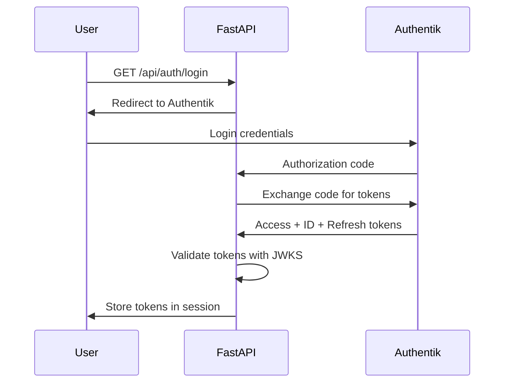
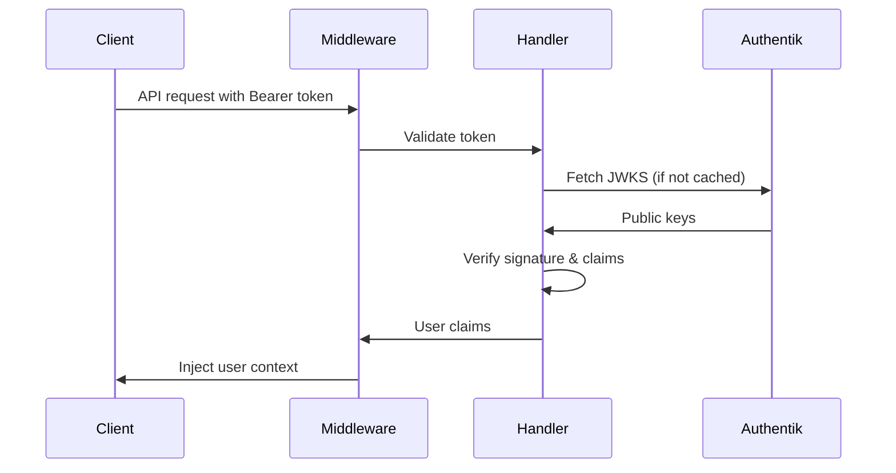

# JWT Handling and Security Guide

## Overview

This guide covers the comprehensive JWT (JSON Web Token) handling and security implementation for the RAG System's integration with Authentik. The system provides secure token validation, signing, and management across the FastAPI application.

## Architecture

### Components

1. **JWT Handler (`jwt_handler.py`)** - Core JWT validation and management
2. **OAuth Client (`oauth_client.py`)** - OAuth2 flow and token exchange
3. **Dependencies (`dependencies.py`)** - FastAPI dependencies for authentication
4. **Middleware (`middleware.py`)** - Request-level JWT validation
5. **Auth Routes (`auth.py`)** - Authentication endpoints

### Security Features

- **RS256 Algorithm** - RSA signature with SHA-256
- **JWKS Integration** - Automatic public key fetching from Authentik
- **Token Validation** - Comprehensive claims validation
- **Security Headers** - CORS, CSP, and other security headers
- **Rate Limiting** - Protection against brute force attacks
- **Session Management** - Secure session handling

## Configuration

### Environment Variables

```bash
# Authentik Configuration
AUTHENTIK_URL=https://auth.zoi.local
AUTHENTIK_ISSUER=https://auth.zoi.local/application/o/default/
AUTHENTIK_API_TOKEN=your-api-token-here

# JWT Configuration
JWT_ACCESS_TOKEN_LIFETIME=3600
JWT_REFRESH_TOKEN_LIFETIME=86400
JWT_ID_TOKEN_LIFETIME=3600
JWT_ALGORITHM=RS256
JWT_AUDIENCE=rag-system
JWKS_CACHE_TTL=3600

# OAuth2 Client Credentials
FASTAPI_OAUTH_CLIENT_ID=fastapi-client
FASTAPI_OAUTH_CLIENT_SECRET=your-client-secret
FASTAPI_OAUTH_REDIRECT_URI=http://zoi.local:8000/api/auth/callback

# Session Configuration
SESSION_SECRET_KEY=your-session-secret-key
```

### JWT Security Configuration

```python
from src.auth.jwt_handler import JWTSecurityConfig

config = JWTSecurityConfig(
    access_token_lifetime=3600,      # 1 hour
    refresh_token_lifetime=86400,    # 24 hours
    id_token_lifetime=3600,          # 1 hour
    algorithm="RS256",               # RSA with SHA-256
    issuer="https://auth.zoi.local/application/o/default/",
    audience="rag-system",
    clock_skew_seconds=60           # Allow 60s clock skew
)
```

## Usage Examples

### 1. Basic JWT Validation

```python
from src.auth.jwt_handler import validate_jwt_token

# Validate an access token
try:
    claims = await validate_jwt_token(token, 'access')
    user_id = claims['sub']
    email = claims['email']
    groups = claims['groups']
except JWTValidationError as e:
    print(f"Token validation failed: {e}")
```

### 2. FastAPI Dependencies

```python
from fastapi import Depends
from src.auth.dependencies import get_current_user, require_scopes

# Require authenticated user
@app.get("/api/protected")
async def protected_endpoint(user: dict = Depends(get_current_user)):
    return {"user": user['email']}

# Require specific scopes
@app.get("/api/admin")
async def admin_endpoint(user: dict = Depends(require_scopes("rag:admin"))):
    return {"message": "Admin access granted"}

# Optional authentication
@app.get("/api/public")
async def public_endpoint(user: dict = Depends(get_current_user_optional)):
    if user:
        return {"message": f"Hello {user['name']}"}
    return {"message": "Hello anonymous user"}
```

### 3. Manual JWT Handler Usage

```python
from src.auth.jwt_handler import JWTHandler

# Create handler
handler = JWTHandler("https://auth.zoi.local")

# Validate access token
claims = await handler.validate_access_token(access_token)

# Validate ID token
id_claims = await handler.validate_id_token(id_token)

# Close handler when done
await handler.close()
```

### 4. OAuth2 Flow

```python
from src.auth.oauth_client import OAuth2Manager

# Initialize OAuth manager
oauth = OAuth2Manager()

# Get authorization URL
auth_url = oauth.get_authorization_url(state="random-state")

# Handle callback
tokens = await oauth.handle_callback(authorization_code)

# Validate tokens
user_info = await oauth.get_user_from_token(tokens['access_token'])
```

## Middleware Integration

### JWT Authentication Middleware

```python
from fastapi import FastAPI
from src.auth.middleware import JWTAuthenticationMiddleware

app = FastAPI()

# Add JWT middleware
app.add_middleware(
    JWTAuthenticationMiddleware,
    protected_paths=["/api/"],
    excluded_paths=["/api/auth/", "/docs", "/health"]
)
```

### CORS and Security Middleware

```python
from src.auth.middleware import CORSAndSecurityMiddleware

app.add_middleware(
    CORSAndSecurityMiddleware,
    allowed_origins=["http://zoi.local:3000"],
    allow_credentials=True
)
```

## Authentication Flow

### 1. Login Process



### 2. API Request with JWT



## Security Considerations

### Token Validation

- **Signature Verification** - All tokens verified against Authentik's JWKS
- **Claims Validation** - Issuer, audience, expiration checked
- **Clock Skew** - 60-second tolerance for time differences
- **Algorithm Verification** - Only RS256 accepted

### Security Headers

```python
{
    "X-Content-Type-Options": "nosniff",
    "X-Frame-Options": "DENY", 
    "X-XSS-Protection": "1; mode=block",
    "Strict-Transport-Security": "max-age=31536000; includeSubDomains",
    "Cache-Control": "no-cache, no-store, must-revalidate"
}
```

### Rate Limiting

- **Authentication Endpoints** - 5 attempts per 15 minutes per IP
- **Token Refresh** - 10 attempts per hour per user
- **Failed Validation** - Exponential backoff

## Error Handling

### JWT Validation Errors

```python
from src.auth.jwt_handler import JWTValidationError

try:
    claims = await validate_jwt_token(token)
except JWTValidationError as e:
    if "expired" in str(e).lower():
        # Token expired - redirect to refresh
        pass
    elif "signature" in str(e).lower():
        # Invalid signature - force re-login
        pass
    elif "issuer" in str(e).lower():
        # Wrong issuer - security issue
        pass
```

### HTTP Error Responses

```json
{
    "error": "Authentication required",
    "detail": "No valid token provided",
    "path": "/api/protected"
}
```

## Testing

### Running JWT Tests

```bash
# Install test dependencies
pip install pytest pytest-asyncio

# Run JWT handler tests
pytest tests/test_jwt_handler.py -v

# Run with coverage
pytest tests/test_jwt_handler.py --cov=src.auth.jwt_handler
```

### Mock Testing

```python
import pytest
from unittest.mock import patch
from src.auth.jwt_handler import validate_jwt_token

@pytest.mark.asyncio
async def test_token_validation():
    with patch('httpx.AsyncClient.get') as mock_get:
        # Mock JWKS response
        mock_get.return_value.json.return_value = {"keys": [...]}
        
        claims = await validate_jwt_token(valid_token)
        assert claims['sub'] == 'test-user'
```

## Troubleshooting

### Common Issues

1. **JWKS Fetch Failures**
   - Check `AUTHENTIK_URL` configuration
   - Verify network connectivity to Authentik
   - Check SSL certificate validity

2. **Token Validation Failures**
   - Verify `AUTHENTIK_ISSUER` matches token issuer
   - Check `JWT_AUDIENCE` configuration
   - Ensure clock synchronization

3. **Session Issues**
   - Verify `SESSION_SECRET_KEY` is set
   - Check session middleware configuration
   - Validate cookie settings

### Debug Logging

```python
import logging

# Enable debug logging for JWT handler
logging.getLogger('src.auth.jwt_handler').setLevel(logging.DEBUG)
logging.getLogger('src.auth.oauth_client').setLevel(logging.DEBUG)
```

## Production Deployment

### Security Checklist

- [ ] Use HTTPS for all endpoints
- [ ] Set strong `SESSION_SECRET_KEY`
- [ ] Configure proper CORS origins
- [ ] Enable rate limiting
- [ ] Set up monitoring and alerting
- [ ] Use Redis for session storage
- [ ] Configure proper logging
- [ ] Set up token refresh automation

### Performance Optimization

- **JWKS Caching** - Cache public keys for 1 hour
- **Connection Pooling** - Reuse HTTP connections
- **Async Operations** - Non-blocking token validation
- **Memory Management** - Proper cleanup of handlers

## API Reference

### JWT Handler Classes

#### `JWTSecurityConfig`
Configuration for JWT security settings.

#### `JWKSManager`
Manages fetching and caching of JSON Web Key Sets.

#### `JWTValidator`
Core JWT token validation logic.

#### `JWTHandler`
High-level JWT handling interface.

### Dependencies

#### `get_current_user()`
Requires valid JWT token, returns user info.

#### `get_current_user_optional()`
Optional authentication, returns None if no token.

#### `require_scopes(*scopes)`
Requires specific OAuth2 scopes.

#### `require_groups(*groups)`
Requires specific user groups.

### Middleware

#### `JWTAuthenticationMiddleware`
Basic JWT validation with user context injection.

#### `JWTValidationMiddleware`
Strict JWT validation for API routes.

#### `CORSAndSecurityMiddleware`
CORS handling and security headers.

## Support

For issues or questions regarding JWT handling:

1. Check the logs for detailed error messages
2. Verify environment configuration
3. Test with the provided test suite
4. Review Authentik configuration
5. Check network connectivity and SSL certificates

## Changelog

### v1.0.0 (Current)
- Initial JWT handling implementation
- RS256 signature validation
- JWKS integration with caching
- FastAPI dependencies and middleware
- Comprehensive test suite
- Security headers and rate limiting
