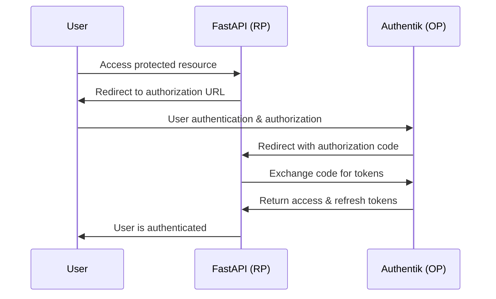

# OAuth2 Setup Guide for Authentik Integration

This guide provides step-by-step instructions for setting up OAuth2 applications in Authentik for the Production RAG System, based on official Authentik documentation.

## Prerequisites

- Authentik services running and accessible at `https://zoi.local:9443`
- Admin access to Authentik with credentials from `.env` file
- FastAPI service configured and running

## Manual Setup via Web Interface

### Step 1: Access Authentik Admin Interface

1. Navigate to `https://zoi.local:9443/if/admin/`
2. Login with:
   - Username: `admin@zoi.local` (or value from `AUTHENTIK_BOOTSTRAP_EMAIL`)
   - Password: `change-me-authentik-admin` (or value from `AUTHENTIK_BOOTSTRAP_PASSWORD`)

### Step 2: Create OAuth2 Providers

For each application (FastAPI, WebUI, n8n), create an OAuth2 provider:

1. Go to **Applications** → **Providers**
2. Click **Create** and select **OAuth2/OpenID Provider**
3. Configure the provider:

#### FastAPI RAG System Provider
```
Name: FastAPI RAG Provider
Authorization flow: default-provider-authorization-explicit-consent
Client type: Confidential
Client ID: fastapi-client
Client Secret: [Generated automatically - copy this value]
Redirect URIs: http://zoi.local:8000/api/auth/callback
Signing Key: [Leave default]
Subject mode: Based on the User's hashed ID
Include claims in id_token: ✓ Enabled
Issuer mode: Each provider has a different issuer
```

#### Open WebUI Provider
```
Name: WebUI Provider
Authorization flow: default-provider-authorization-explicit-consent
Client type: Confidential
Client ID: webui-client
Client Secret: [Generated automatically - copy this value]
Redirect URIs: http://zoi.local:3000/auth/callback
Subject mode: Based on the User's hashed ID
Include claims in id_token: ✓ Enabled
Issuer mode: Each provider has a different issuer
```

#### n8n Workflow Provider
```
Name: n8n Provider
Authorization flow: default-provider-authorization-explicit-consent
Client type: Confidential
Client ID: n8n-client
Client Secret: [Generated automatically - copy this value]
Redirect URIs: http://zoi.local:5678/rest/oauth2-credential/callback
Subject mode: Based on the User's hashed ID
Include claims in id_token: ✓ Enabled
Issuer mode: Each provider has a different issuer
```

### Step 3: Create Applications

For each provider created above, create a corresponding application:

1. Go to **Applications** → **Applications**
2. Click **Create**
3. Configure the application:

#### FastAPI RAG System Application
```
Name: FastAPI RAG System
Slug: fastapi-rag
Provider: FastAPI RAG Provider (select from dropdown)
Launch URL: http://zoi.local:8000
Description: FastAPI-based RAG system with OAuth2 authentication
Icon: [Optional]
```

#### Open WebUI Application
```
Name: Open WebUI
Slug: open-webui
Provider: WebUI Provider (select from dropdown)
Launch URL: http://zoi.local:3000
Description: Open WebUI chat interface
Icon: [Optional]
```

#### n8n Workflow Application
```
Name: n8n Workflow
Slug: n8n-workflow
Provider: n8n Provider (select from dropdown)
Launch URL: http://zoi.local:5678
Description: n8n workflow automation platform
Icon: [Optional]
```

### Step 4: Update Environment Variables

Copy the generated client secrets from each provider and update your `.env` file:

```bash
# OAuth2 Client Credentials
FASTAPI_OAUTH_CLIENT_ID=fastapi-client
FASTAPI_OAUTH_CLIENT_SECRET=<copy-from-fastapi-provider>
FASTAPI_OAUTH_REDIRECT_URI=http://zoi.local:8000/api/auth/callback

WEBUI_OAUTH_CLIENT_ID=webui-client
WEBUI_OAUTH_CLIENT_SECRET=<copy-from-webui-provider>

N8N_OAUTH_CLIENT_ID=n8n-client
N8N_OAUTH_CLIENT_SECRET=<copy-from-n8n-provider>
```

### Step 5: Configure OAuth2 Endpoints

The OAuth2 endpoints for your applications will be:

#### Authorization URL
```
https://zoi.local:9443/application/o/authorize/
```

#### Token URL
```
https://zoi.local:9443/application/o/token/
```

#### User Info URL
```
https://zoi.local:9443/application/o/userinfo/
```

#### Issuer URL (per application)
```
FastAPI: https://zoi.local:9443/application/o/fastapi-rag/
WebUI: https://zoi.local:9443/application/o/open-webui/
n8n: https://zoi.local:9443/application/o/n8n-workflow/
```

## Automated Setup Script

Alternatively, you can use the automated setup script:

```bash
# Make the script executable
chmod +x scripts/setup-authentik-oauth.py

# Run the setup script
python3 scripts/setup-authentik-oauth.py
```

The script will:
1. Authenticate with Authentik using admin credentials
2. Create OAuth2 providers for all applications
3. Create applications linked to the providers
4. Update the `.env` file with generated client secrets
5. Provide a summary of created applications

## Testing the OAuth2 Integration

### Step 1: Restart FastAPI Service

After updating the `.env` file, restart the FastAPI service:

```bash
docker-compose restart fastapi-1
```

### Step 2: Test OAuth2 Status

Check if OAuth2 is properly configured:

```bash
curl -s http://zoi.local:8000/api/auth/status | jq .
```

Expected response:
```json
{
  "authenticated": false,
  "user": null,
  "oauth_configured": true
}
```

### Step 3: Test OAuth2 Login Flow

1. Navigate to `http://zoi.local:8000/api/auth/login`
2. You should be redirected to Authentik for authentication
3. Login with your Authentik credentials
4. You should be redirected back to FastAPI with authentication

### Step 4: Verify User Information

After successful login, check user information:

```bash
curl -s http://zoi.local:8000/api/auth/me | jq .
```

## OAuth2 Flow Diagram



## Troubleshooting

### Common Issues

1. **"oauth_configured": false**
   - Check that `FASTAPI_OAUTH_CLIENT_SECRET` is set in `.env`
   - Verify that the client secret matches the one from Authentik

2. **Redirect URI mismatch**
   - Ensure the redirect URI in Authentik matches exactly: `http://zoi.local:8000/api/auth/callback`
   - Check for trailing slashes or protocol mismatches

3. **Invalid client credentials**
   - Verify client ID and secret are correct
   - Check that the provider is properly configured in Authentik

4. **SSL/TLS issues**
   - For development, the FastAPI OAuth client is configured to skip SSL verification
   - In production, ensure proper SSL certificates are configured

### Logs and Debugging

Check FastAPI logs for OAuth2 issues:
```bash
docker-compose logs fastapi-1 --tail=50
```

Check Authentik logs:
```bash
docker-compose logs authentik-server --tail=50
```

## Security Considerations

1. **Client Secrets**: Store client secrets securely and rotate them regularly
2. **Redirect URIs**: Use exact matches for redirect URIs to prevent authorization code interception
3. **HTTPS**: Use HTTPS in production for all OAuth2 endpoints
4. **Token Storage**: Store tokens securely and implement proper session management
5. **Scope Limitation**: Use minimal required scopes for each application

## Next Steps

After successful OAuth2 setup:

1. Configure additional scopes if needed
2. Set up user groups and permissions in Authentik
3. Implement role-based access control in FastAPI
4. Configure other applications (WebUI, n8n) to use OAuth2
5. Set up monitoring and logging for authentication events
