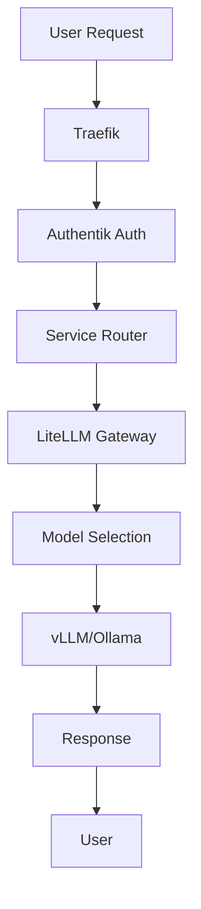
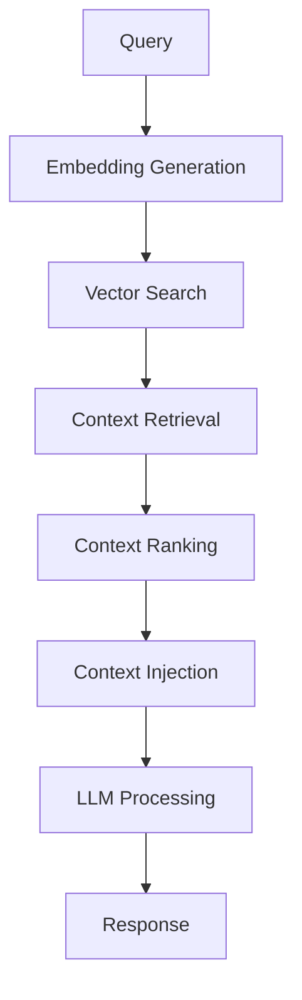

# 🔧 ZOI Technical Architecture - Deep Dive

> **Technical implementation details and architectural decisions for the ZOI AI ecosystem**

## 🏗️ Microservices Architecture

### Service Stack Composition

#### Core Stack (`apps/core/`)
**Purpose**: AI infrastructure and model serving
```yaml
Services:
  - litellm: Unified AI gateway (Port 7010)
  - vllm: High-performance inference (Port 7050)
  - ollama: Local model serving (Port 7040)
  - qdrant: Vector database (Port 7060)
  - neo4j: Graph database (Port 7061)
  - langflow: Visual AI workflows (Port 7070)
  - postgres: Primary database (Port 7063)
  - redis: Caching layer (Port 7064)
  - unified-rag: Cross-collection search (Port 7090)
```

#### Platform Stack (`apps/platform/`)
**Purpose**: Base infrastructure services
```yaml
Services:
  - traefik: Reverse proxy and load balancer
  - authentik: Identity provider and SSO
  - mongodb: Document database (Port 7202)
  - dashy: Service dashboard
```

#### Tools Stack (`apps/tools/`)
**Purpose**: Productivity and user interfaces
```yaml
Services:
  - n8n: Workflow automation (Port 7301)
  - lobechat: Modern AI chat interface (Port 7302)
  - openwebui: Multi-model chat (Port 7303)
```

#### Archon MCP Stack (`apps/archon-mcp/`)
**Purpose**: Knowledge management and MCP services
```yaml
Services:
  - archon-server: FastAPI backend (Port 7081)
  - archon-ui: React frontend (Port 7080)
  - archon-mcp: MCP server (Port 7082)
  - archon-agents: AI processing (Port 7083)
```

## 🤖 AI Model Architecture

### LiteLLM Gateway Configuration
```yaml
Routing Strategy: cost-based-routing
Master Key: sk-wqn0xwq_vha4MVM2yzw
Default Model: zoi-coder-vllm
Fallback Models: [zoi-coder-vllm]
Timeout: 300 seconds
```

### Model Routing Logic
```yaml
Complex Coding Tasks:
  Primary: zoi-coder-vllm (vLLM)
  Fallback: zoi-helper (Ollama)

General Reasoning:
  Primary: zoi-thinker (Ollama)
  Fallback: zoi-coder-vllm (vLLM)

Quick Assistance:
  Primary: zoi-helper (Ollama)
  Fallback: zoi-thinker (Ollama)

Embeddings:
  Primary: zoi-embed (Ollama)
  Model: mxbai-embed-large
```

### GPU Resource Allocation
```yaml
vLLM Service:
  GPU: Primary GPU allocation
  Model: Qwen2.5-Coder-7B-Instruct
  Memory: Optimized for code generation
  
Ollama Service:
  GPU: Shared GPU allocation
  Models: Qwen2.5-7B variants
  Memory: Optimized for reasoning tasks
```

## 🗄️ Database Architecture

### PostgreSQL Multi-Database Setup
```sql
Databases:
  - postgres: Default database
  - litellm: LiteLLM persistence
  - langflow: LangFlow workflows
  - authentik: Authentication data
  - archon: Knowledge management
  - n8n: Workflow automation

Extensions:
  - pgvector: Vector similarity search
  - uuid-ossp: UUID generation
  - pg_stat_statements: Query statistics
```

### Shared Embeddings Table
```sql
CREATE TABLE shared.embeddings (
    id UUID PRIMARY KEY DEFAULT gen_random_uuid(),
    service_name TEXT NOT NULL,
    content_id TEXT NOT NULL,
    content_text TEXT,
    embedding vector(1536), -- OpenAI embedding dimension
    metadata JSONB DEFAULT '{}',
    created_at TIMESTAMP WITH TIME ZONE DEFAULT NOW(),
    updated_at TIMESTAMP WITH TIME ZONE DEFAULT NOW()
);
```

### Qdrant Collection Schema
```yaml
Collections:
  zoi_knowledge_base:
    vector_size: 1024
    distance: cosine
    payload_schema:
      service: keyword
      source: keyword
      document_type: keyword
      tags: keyword
      created_at: datetime

  code_embeddings:
    vector_size: 1024
    distance: cosine
    payload_schema:
      repository: keyword
      language: keyword
      complexity: integer
      file_type: keyword
```

## 🔄 Unified RAG Architecture

### Cross-Collection Search Pipeline
```python
Search Stages:
  1. Vector Search: Parallel search across all Qdrant collections
  2. PostgreSQL Search: Query shared embeddings table
  3. Graph Expansion: Neo4j relationship traversal
  4. Intelligent Ranking: Weighted scoring by collection
  5. Deduplication: Remove similar content
  6. Context Fusion: Merge results for comprehensive context
```

### Collection Weights
```yaml
zoi_knowledge_base: 1.0    # Primary knowledge
code_embeddings: 0.9       # Code context
archon_knowledge: 0.8      # AI agent knowledge
lobechat_agents: 0.8       # Agent configurations
openwebui_conversations: 0.7 # Chat history
n8n_workflows: 0.6         # Automation workflows
user_preferences: 0.5      # User settings
litellm_cache: 0.4         # Cached responses
```

### Hybrid RAG Implementation
```yaml
LiteLLM Native RAG:
  - Single collection access
  - OpenAI API compatibility
  - Built-in context injection
  - UI management interface

Custom Unified RAG:
  - Cross-collection intelligence
  - Multi-database fusion
  - Advanced ranking algorithms
  - Custom search pipelines
```

## 🌐 Network Architecture

### Docker Network Configuration
```yaml
Network: zoi-network
Type: bridge
Driver: bridge
Scope: local
Internal: false
```

### Service Discovery
```yaml
DNS Resolution:
  - Services communicate via container names
  - Automatic service registration
  - Health check integration
  - Load balancing support
```

### Traefik Routing Configuration
```yaml
Entrypoints:
  web: :80 (HTTP)
  websecure: :443 (HTTPS)

Routers:
  - Host: zoi.local → Dashy dashboard
  - Host: ai.zoi.local → LiteLLM gateway
  - Host: chat.zoi.local → LobeChat
  - Host: flows.zoi.local → LangFlow
  - Host: voice.zoi.local → Voice interface
```

## 🔐 Security Architecture

### Authentication Flow
```yaml
Authentik SSO:
  - OAuth2/OIDC provider
  - LDAP integration support
  - Multi-factor authentication
  - Role-based access control

API Security:
  - Bearer token authentication
  - API key management
  - Rate limiting
  - Request validation
```

### Network Security
```yaml
Isolation:
  - Docker network isolation
  - Service-to-service communication
  - No direct external access
  - Traefik as single entry point

Encryption:
  - TLS termination at Traefik
  - Internal HTTP communication
  - Database connection encryption
  - API key encryption
```

## 📊 Monitoring Architecture

### Metrics Collection
```yaml
Prometheus Targets:
  - LiteLLM metrics (AI usage, costs)
  - Container metrics (cAdvisor)
  - System metrics (node-exporter)
  - Database metrics (postgres-exporter)
  - Custom application metrics
```

### Grafana Dashboards
```yaml
Dashboards:
  - AI Services Monitoring
  - System Overview
  - Container Performance
  - Database Monitoring
  - Cost Tracking
  - Alert Management
```

### Alerting Rules
```yaml
Alert Categories:
  - High CPU/Memory usage
  - Service downtime
  - Database connection issues
  - AI model failures
  - Cost threshold breaches
```

## 🔄 Data Flow Architecture

### Request Processing Flow


### RAG Processing Flow


## 🚀 Performance Optimizations

### Caching Strategy
```yaml
Redis Caching:
  - Session management
  - API response caching
  - Embedding caching
  - Workflow state caching

Database Optimization:
  - Connection pooling
  - Query optimization
  - Index management
  - Vacuum scheduling
```

### Resource Management
```yaml
GPU Allocation:
  - vLLM: Primary GPU access
  - Ollama: Shared GPU access
  - Memory management
  - Concurrent request handling

CPU/Memory:
  - Container resource limits
  - Horizontal scaling support
  - Load balancing
  - Health check monitoring
```

This technical architecture provides the detailed implementation context for understanding how ZOI's components work together to create a cohesive AI ecosystem.
